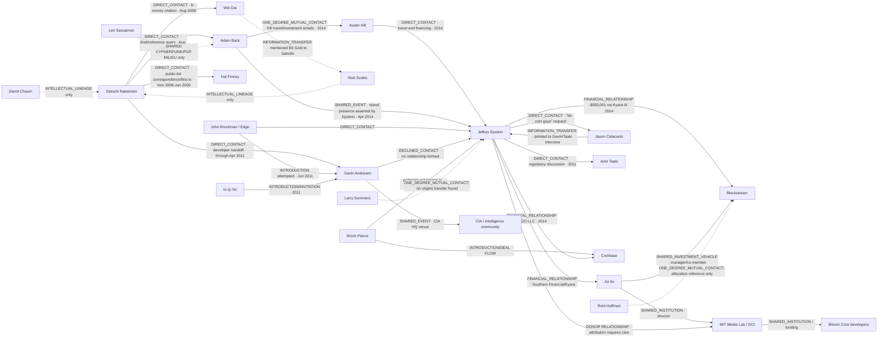

# Satoshi network map

## Evidence-constrained graph

Dashed edges are indirect, intellectual, or proximity relationships. They are not evidence of information moving to Epstein.

## Edge register

| From → to | Edge type | Date | What is documented | What is not documented | Source |
|---|---|---|---|---|---|
| Satoshi → Adam Back | DIRECT_CONTACT, INFORMATION_TRANSFER | 2008-08-20/21 | Draft/reference query; Back points to b-money. | Any Epstein involvement. | Back correspondence exhibit |
| Satoshi → Wei Dai | DIRECT_CONTACT | 2008-08-22 | Citation request; Dai supplies citation and mentions Bit Gold. | Ongoing collaboration or Epstein involvement. | Dai correspondence exhibit |
| Satoshi → Gavin | DIRECT_CONTACT | 2010–2011 | Development correspondence and alert-key handoff. | That the April 26 email was Satoshi’s final message to anyone. | Gavin archive |
| Satoshi → Hal Finney | DIRECT_CONTACT | 2008-11 onward | Public-list exchange and first recorded transaction. | Pre-publication draft receipt. | metzdowd archive/blockchain |
| Wei Dai → Nick Szabo | INFORMATION_TRANSFER | 2008-08 | Dai mentions Bit Gold to Satoshi. | A direct Satoshi–Szabo pre-publication exchange. | Dai correspondence |
| Adam Back ↔ Epstein | SHARED_EVENT / DIRECT_CONTACT plausible | 2014-04 | Coordinated St. Thomas travel; island visit contemplated; Epstein claims Back was there; follow-up email copies Back. | Meeting topic, repeat meetings, awareness of Epstein as investor. | EFTA00987576, 00987642, 00988395, 01926082 |
| Epstein → Blockstream | FINANCIAL_RELATIONSHIP | 2014 | $500,001 via Southern Financial/Kyara. | Control of Blockstream or Bitcoin. | EFTA00584696, 00027019, 00080250 |
| Epstein ↔ Joi Ito | FINANCIAL_RELATIONSHIP | 2014–15 | Joint Kyara vehicle; continuing donor/investment contact. | That every Ito project used Epstein money. | Kyara and Ito emails |
| Brockman → Gavin | INTRODUCTION (attempted) | 2011-06 | Brockman identifies Gavin and proposes contact. | Completed contact. Gavin declined. | EFTA00629471, 00432104 |
| In-Q-Tel → Gavin | INTRODUCTION/INVITATION | 2011 | In-Q-Tel invited Gavin to the intelligence-community conference. | An In-Q-Tel role in Bitcoin’s creation. | Gavin email/post |
| Gavin → CIA venue | SHARED_EVENT | 2011-06-14 | Gavin says event occurred at CIA HQ. | A private operational relationship or coordination with Epstein. | BitcoinTalk |
| Epstein ↔ Taaki | DIRECT_CONTACT | 2011 | Regulatory discussion; Norman introduction. | Investment or protocol work. | EFTA00656005 |
| Pierce → Epstein → Coinbase | INTRODUCTION + FINANCIAL_RELATIONSHIP | 2010–14 | Pierce pathway and IGO investment. | Satoshi/origins relevance. | EFTA00901408; Coinbase file set |
| Epstein → MIT DCI → developers | DONATION/SHARED_INSTITUTION | 2015 | Ito attributed speed in launching DCI to gift funds; MIT housed developers. | Epstein direction of code or developers. | EFTA00680068; MIT DCI records |

## People with no demonstrated Epstein edge

- **Wei Dai:** no direct or meaningful indirect contact found.
- **Hal Finney:** no direct or meaningful short documented path found.
- **Nick Szabo:** no direct contact found; broad economics/law/technology proximity is not an edge.
- **Len Sassaman:** no Epstein contact found; cypherpunk/PGP ties connect him to the technical milieu, not to Epstein.
- **David Chaum:** intellectual predecessor to Bitcoin; no Epstein/DigiCash path found.

## Information pathways

1. **Satoshi → Adam Back → Austin Hill → Epstein** — three contact edges, but the chain only closes in 2014. Information transfer from Satoshi to Epstein is **UNSUPPORTED**.
2. **Satoshi → Gavin ← Brockman ← Epstein** — the proposed June 2011 bridge did not complete because Gavin declined. **INTRODUCTION ATTEMPT**, not information transfer.
3. **Pierce → Epstein → Coinbase** — documented deal flow after Bitcoin became public. **INTRODUCTION + FINANCIAL_RELATIONSHIP**.
4. **Epstein → Joi Ito → MIT DCI → Bitcoin Core developers** — documented donor/institutional path in 2015; no evidence Epstein directed development. **FINANCIAL/SHARED-INSTITUTION PATH**.

No located pathway shows Bitcoin design information reaching Epstein before October 31, 2008.

## Gap-closing additions

- **Pierce chronology:** Seckel placed Pierce in Epstein's gathering network by November 2010 and pitched his gaming virtual-currency experience in December. Direct Pierce→Epstein virtual-currency correspondence is first located in September 2011. This strengthens Pierce as the commercial gateway but does not create a Satoshi edge.
- **“Reid”:** Reid Hoffman is now a **STRONG_INFERENCE** rather than unresolved. EFTA01748990 explicitly places Hoffman, Epstein, Ito, and Hill in the same Blockstream allocation/conflict thread. No evidence shows Hoffman knew the Kyara beneficial-owner or wire details.
- **Hill paper:** Hill's May 2014 link was an external Marshall Van Alstyne essay; Epstein forwarded the message to Andrew Farkas. It is an information-circulation edge, not a pre-publication or protocol edge.
- **2016 “founders” claim:** Epstein's statement that he spoke with “some of the founders of bitcoin” is uncorroborated self-report and does not alter the no-Satoshi-contact finding.
- **Recommended Satoshi treatment:** OPTION B—a short timeline/sidebar explaining verified adjacency and failed edges. A full origins section would overweight negative evidence.

## Pre-publication contact audit

### Documented

- **Adam Back:** Satoshi’s 2008-08-20 message supplied a draft/reference context; Back replied and pointed him to b-money.
- **Wei Dai:** Satoshi’s 2008-08-22 message requested the b-money citation; Dai replied and mentioned Bit Gold.

### Later recollection

Later participants have described what they remember about Bitcoin’s emergence. Such memories are useful leads but are not counted as pre-publication contact unless backed by a dated contemporaneous message.

### Inference

It is reasonable to infer that Satoshi read or knew the published work he cited. Citation and influence do not establish personal correspondence. Hal Finney’s documented exchange begins after the public announcement.

### Internet lore

Claims that a larger hidden group saw the draft, or that a particular cypherpunk must therefore have been Satoshi, are unsupported absent authenticated dated records.

## Pre-Bitcoin digital-cash lineage (intellectual, not an Epstein social graph)

| Predecessor | Contribution | Relationship to Bitcoin | Epstein-corpus result |
|---|---|---|---|
| David Chaum / DigiCash | Blind signatures and privacy-preserving electronic cash | Foundational digital-cash lineage | No meaningful Epstein/Chaum or DigiCash path found. |
| Timothy May / Cypherpunks list | Political and technical milieu for cryptographic privacy and money | Community context | No direct Epstein/May path found. |
| Adam Back / Hashcash | Proof-of-work anti-spam system | Cited in Bitcoin; direct pre-publication contact | Epstein overlap first located in 2014. |
| Wei Dai / b-money | Distributed pseudonymous money proposal | Cited; direct pre-publication contact | No Epstein path found. |
| Nick Szabo / Bit Gold | Scarce digital-object proposal | Closely related intellectual predecessor; Dai mentioned it to Satoshi | No direct Epstein path found. |
| Hal Finney / RPOW | Reusable proof-of-work | Technical predecessor; later early Bitcoin correspondent/recipient | No meaningful Epstein path found. |
| Len Sassaman / Mixmaster and PGP | Privacy infrastructure and cypherpunk network | Social/technical milieu, not a documented pre-release Bitcoin contact | No Epstein path found. |
| e-gold | Centralized digital gold/payment system | Regulatory/commercial predecessor, architecturally unlike Bitcoin | Appears in the 2011 Norman regulatory discussion, not as a 2008 design source. |
| metzdowd cryptography list | Venue for public white-paper announcement and early discussion | Public launch channel | No pre-announcement Epstein link found. |
